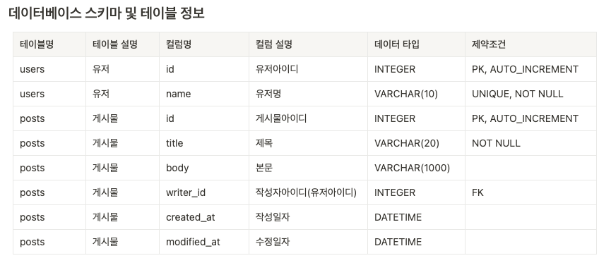

## 소개
Python 3.11 + Fast API로 만든 게시판 CRUD  
 
**DataBase**: SQLite

## 데이터베이스 스키마 정보 및 테이블 정보

## API 테스트 방법
프레임워크는 빠르게 구현할 수 있고, Swagger(자동 문서화)를 제공하는 FastAPI를 사용했습니다.
아래 URL을 통해서 API를 테스트 할 수 있습니다.
- http://localhost:8000/docs

- **게시물 생성 API**
    - Path Variable인 user_name은 "user_name"을 입력해주시면 됩니다.
    - Request Body에 title만 넣어도 게시물 생성이 됩니다.
    - 최근에 한국방송통신대학교에서 Path Variable에 user_id로 설정했다가 보안 이슈가 생긴 적이 있어서 user_name으로 설정해보았습니다.
- **유저 생성 API**
    - 혹시라도 유저 데이터가 들어있지 않을 경우를 대비해서 구현 해놓았습니다.

## API 스펙 문서
- http://localhost:8000/redoc

## Java/Spring 게시물 CRUD 목록
이전에 Java/Spring으로 게시물 CRUD 구현했던 repository

1. [팀 프로젝트](https://github.com/jazz-meet/jazz-meet/tree/dev/be/src/main/java/kr/codesquad/jazzmeet/inquiry)
    - **Rest API로 Inquiry(문의게시물) CRUD 구현**
    - Inquiry 의 CRUD 구현

2. [개인 프로젝트](https://github.com/sudago/be-java-cafe-max/blob/jian/src/main/java/kr/codesqaud/cafe/controller/article/ArticleController.java)
    - **Template engine으로 view 구현 + Article(게시물) CRUD 구현**
    - Rest API X
